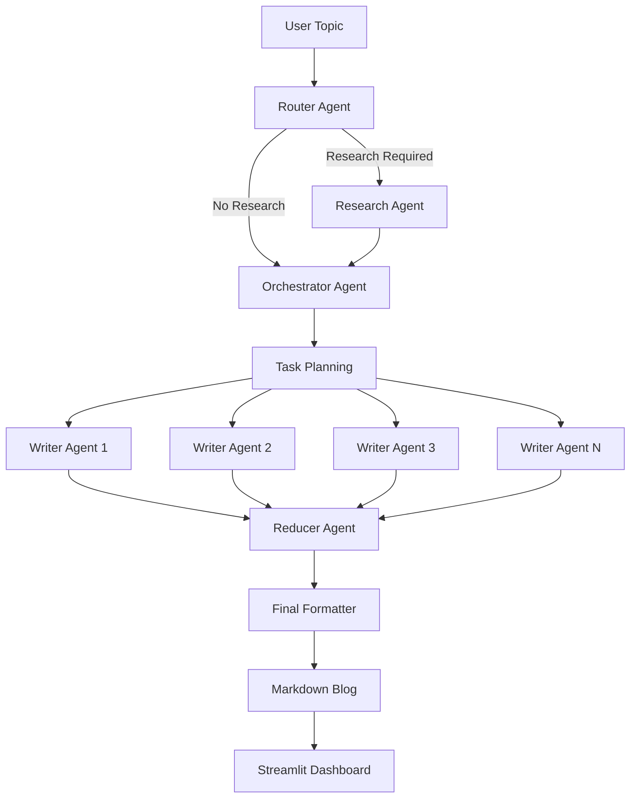
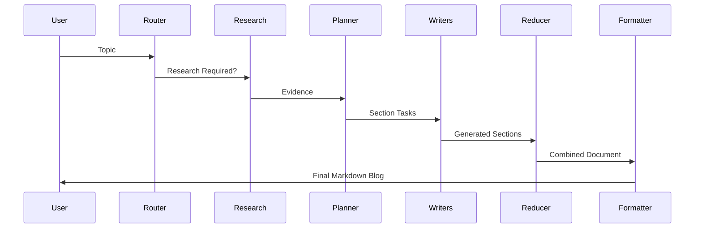

# 🚀 AI Blog Writing Agent

<p align="center">
  <strong>Autonomous Multi-Agent Content Generation System</strong>
</p>

<p align="center">
  Research • Planning • Parallel Writing • Reduction • Formatting
</p>

<p align="center">
  Built with LangGraph, Ollama, Tavily Search, Pydantic, and Streamlit
</p>

---

## 🌟 Overview

AI Blog Writing Agent is a production-style multi-agent system that autonomously researches, plans, writes, and assembles long-form technical blog posts.

Unlike traditional prompt-based applications, this system decomposes content generation into specialized AI agents that collaborate through a structured workflow. Each agent is responsible for a single task, resulting in higher-quality, more scalable, and more maintainable outputs.

The project demonstrates real-world AI engineering concepts including:

* Agentic AI
* Workflow Orchestration
* Dynamic Routing
* Retrieval-Augmented Generation (RAG)
* Parallel Agent Execution
* Structured LLM Outputs
* State Management
* Real-Time Observability

---

# 🎯 Problem Statement

Generating high-quality technical content is a complex multi-step process.

A typical workflow requires:

* Researching the topic
* Collecting evidence
* Creating an outline
* Structuring sections
* Writing content
* Maintaining consistency
* Formatting the final output

Single-prompt approaches often fail because:

* Context becomes too large
* Content quality degrades over long outputs
* Structure becomes inconsistent
* Citations are difficult to manage
* Research and writing are tightly coupled

This project solves these challenges using a distributed multi-agent architecture.

---

# ✨ Key Highlights

### 🤖 Multi-Agent Architecture

Specialized agents collaborate to complete complex content generation workflows.

### 🔍 Autonomous Research

Automatically determines whether external research is required and gathers evidence using Tavily Search.

### 🧠 Intelligent Routing

Dynamically selects:

* Closed Book Mode
* Hybrid Mode
* Open Book Mode

based on topic requirements.

### ⚡ Parallel Content Generation

Multiple writer agents generate sections simultaneously using LangGraph fan-out execution.

### 📊 Real-Time Observability

Track:

* Agent Status
* Workflow Progress
* Logs
* Section Completion

through a live Streamlit dashboard.

### 📦 Structured Outputs

Pydantic schemas enforce deterministic and reliable LLM responses across the pipeline.

### 📝 Production-Ready Markdown Export

Generates publication-ready Markdown documents.

---

# 🏗️ System Architecture



---

# 🧠 Agent Workflow

## 1. Router Agent

The Router acts as the decision-making layer.

Responsibilities:

* Analyze topic complexity
* Determine research requirements
* Select execution mode
* Generate search queries

### Supported Modes

| Mode        | Purpose                             |
| ----------- | ----------------------------------- |
| Closed Book | Evergreen concepts and fundamentals |
| Hybrid      | Concepts requiring current examples |
| Open Book   | News, trends, latest developments   |

Example:

```json
{
  "needs_research": true,
  "mode": "hybrid",
  "queries": [
    "LangGraph architecture",
    "LangGraph latest updates",
    "LangGraph production deployments"
  ]
}
```

---

## 2. Research Agent

If research is required:

1. Executes Tavily searches
2. Collects evidence
3. Deduplicates sources
4. Produces structured evidence objects

Output:

```json
{
  "title": "LangGraph Documentation",
  "url": "https://...",
  "snippet": "...",
  "published_at": "2025-01-15"
}
```

---

## 3. Orchestrator Agent

Transforms the topic into an actionable writing plan.

Produces:

* Blog Title
* Audience Definition
* Writing Tone
* Section Structure
* Writing Tasks

Example:

```text
1. Introduction
2. Core Concepts
3. System Architecture
4. Implementation
5. Best Practices
6. Performance Considerations
7. Conclusion
```

---

## 4. Parallel Writer Agents

The plan is decomposed into independent writing tasks.

Each Writer Agent:

* Receives one section
* Generates content independently
* Uses evidence when required
* Produces markdown output

This enables:

* Faster generation
* Better scalability
* Cleaner content boundaries

### Fan-Out Execution

```text
Task 1 → Writer Agent 1

Task 2 → Writer Agent 2

Task 3 → Writer Agent 3

Task N → Writer Agent N
```

---

## 5. Reducer Agent

Collects outputs from all writer agents.

Responsibilities:

* Sort sections
* Merge content
* Preserve ordering
* Assemble complete document

Output:

```markdown
# Blog Title

## Introduction

...

## Architecture

...

## Conclusion
```

---

## 6. Final Formatting Agent

Acts as an editorial layer.

Responsibilities:

* Improve readability
* Normalize headings
* Standardize markdown
* Preserve citations
* Preserve code blocks

The final result becomes publication-ready Markdown.

---

# 🔄 End-to-End Workflow



---

# 📸 Frontend Dashboard

The Streamlit interface provides complete visibility into the workflow.

### Agent Status Tracking

Track every stage:

* Router
* Research
* Planning
* Writing
* Reducer
* Images
* Complete

---

### Real-Time Logs

Example:

```text
[10:14:05] Router selected HYBRID

[10:14:08] Running Tavily Search

[10:14:13] Generated 6 writing tasks

[10:14:21] Worker 1 completed

[10:14:24] Worker 2 completed

[10:14:27] Reducer started
```

---

### Live Progress Monitoring

Observe:

* Execution progress
* Active agents
* Section completion
* Workflow state

in real time.

---

# ⚙️ Technology Stack

## AI & Agent Frameworks

* LangGraph
* LangChain
* Ollama
* Qwen 3 8B

## Search & Research

* Tavily Search API

## Validation & Structure

* Pydantic

## Frontend

* Streamlit

## Language

* Python

---

# 📂 Project Structure

```text
project/
│
├── frontend/
│   └── app.py
│
├── backend/
│   ├── router.py
│   ├── research.py
│   ├── orchestrator.py
│   ├── worker.py
│   ├── reducer.py
│   └── graph.py
│
├── output/
│   └── generated_blog.md
│
├── .env
├── requirements.txt
└── README.md
```

---

# 🚀 Getting Started

## 1. Clone Repository

```bash
git clone https://github.com/yourusername/ai-blog-writing-agent.git

cd ai-blog-writing-agent
```

---

## 2. Install Dependencies

```bash
pip install -r requirements.txt
```

---

## 3. Configure Environment Variables

Create a `.env` file.

```env
TAVILY_API_KEY=your_api_key
```

---

## 4. Start Ollama

```bash
ollama serve
```

Pull the required model:

```bash
ollama pull qwen3:8b
```

---

## 5. Run Streamlit

```bash
streamlit run app.py
```

---

# 📈 Engineering Challenges Solved

## Reliable Structured Generation

Large Language Models frequently produce malformed outputs.

Solution:

* Pydantic schemas
* Structured output enforcement
* Validation at every stage

---

## Dynamic Workflow Routing

Not every topic requires external research.

Solution:

* Router Agent
* Context-aware execution paths
* Reduced latency and cost

---

## Parallel Agent Execution

Generating long-form content sequentially becomes slow.

Solution:

* LangGraph fan-out/fan-in architecture
* Concurrent writer agents

---

## State Management

Multiple agents require shared context.

Solution:

* Typed LangGraph State
* Deterministic transitions
* Explicit graph execution

---

## Real-Time Observability

Agent workflows are difficult to debug.

Solution:

* Live status tracking
* Progress indicators
* Execution logs

---

# 📚 AI Concepts Demonstrated

### Agentic AI

Independent AI agents collaborating toward a shared objective.

### Workflow Orchestration

State-driven execution using LangGraph.

### Retrieval-Augmented Generation

Research-backed content generation.

### Parallel Computing

Concurrent writer execution.

### Structured AI Outputs

Pydantic-powered validation.

### Human-in-the-Loop Ready Design

Architecture can easily support review and editing workflows.

---

# 🔮 Future Enhancements

### Image Generation Agent

Automatic diagram creation for technical blogs.

### SEO Optimization Agent

Meta descriptions, keywords, and structured metadata.

### Citation Agent

Automatic citation formatting and bibliography generation.

### Vector Database Memory

Persistent long-term agent memory.

### Human Review Workflow

Approve or modify sections before publishing.

### Direct Publishing

Export directly to:

* WordPress
* Medium
* Notion
* Dev.to

### Distributed Execution

Move from local execution to scalable cloud workers.

---

# 🎓 Key Learnings

This project demonstrates hands-on experience with:

* AI Agent Engineering
* LangGraph
* LangChain
* Workflow Orchestration
* Retrieval-Augmented Generation
* Parallel Processing
* State Management
* Structured LLM Outputs
* Streamlit Development
* Production AI System Design

---

# 💼 Why This Project Matters

Most AI projects stop at prompt engineering.

This project focuses on building a complete AI system.

It showcases the ability to:

* Design multi-agent architectures
* Build autonomous workflows
* Integrate external tools
* Manage state across agents
* Implement parallel execution
* Create production-ready AI applications
* Deliver end-to-end user experiences

The same architecture can be extended to:

* Research Assistants
* Technical Documentation Systems
* Knowledge Management Platforms
* Autonomous Report Generation
* Enterprise Content Automation
* AI Consulting Solutions

---

# ⭐ If You Found This Interesting

Consider starring the repository and connecting with me to discuss:

* AI Agents
* LangGraph
* LLM Systems
* Agentic Workflows
* Production AI Engineering

---

<p align="center">
Built with ❤️ using LangGraph, Ollama, Tavily, Streamlit, and a passion for AI Engineering.
</p>
