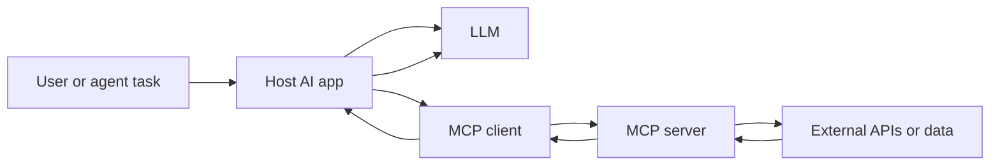

# Why MCP Servers Are Taking Off: A Developer’s Guide to the New AI Tool Layer

## Why MCP Servers Are Rising Now

An MCP server is a standardized provider of tools, resources, and prompts that an AI application consumes through a host and client stack, usually over JSON-RPC transports. Instead of each agent needing a bespoke connector, the server exposes capabilities in a consistent shape.

This resembles earlier integration patterns—plugins, webhooks, SDK-specific connectors, and one-off API clients—but with a narrower contract for LLM-facing work. Plugins often target one product. Webhooks push events but do not define tool discovery. SDK connectors bind tightly to a framework. MCP aims to make the same server usable by multiple hosts.

Fresh ecosystem signals suggest growing infrastructure around discovery. GitHub announced an MCP Registry as a central hub for finding, installing, and managing MCP servers ([Source](https://github.blog/ai-and-ml/generative-ai/how-to-find-install-and-manage-mcp-servers-with-the-github-mcp-registry)). The protocol site also lists an MCP Registry for servers and tools ([Source](https://modelcontextprotocol.info/tools/registry)). Analyst and vendor coverage increasingly frames MCP as part of enterprise AI integration, though adoption statistics should be treated as claims requiring source checks rather than assumed facts.

The architectural pull is clear: developers want reusable tools across coding assistants, agents, and enterprise AI apps without rewriting authentication, SSRF protections, rate-limit handling, performance budgets, cost controls, and debugging paths for every model host.

## MCP Basics: Hosts, Clients, Servers, Tools, and Resources

MCP is a way for an LLM application to connect a host to external capabilities without baking each API into the app.

In MCP terms:

- The **host** is the AI application: an IDE assistant, chatbot, agent framework, or enterprise workflow app. It owns the user interface, model calls, conversation state, and policy decisions.
- The **MCP client** runs inside the host. It speaks the MCP protocol, discovers what a server offers, and sends requests on the host’s behalf.
- The **MCP server** exposes capabilities. It is not the LLM. It is a connector to a file system, database, ticketing system, search index, code repo, or internal API.

The main MCP object types are:

- **Tools**: callable operations with input schemas, such as search tickets, run a query, or update a record.
- **Resources**: readable data exposed by the server, such as documents, records, logs, or repository files.
- **Prompts**: reusable prompt templates the server can provide for common workflows.
- **Transports**: the communication channel carrying MCP messages, typically JSON-RPC request and response messages.

A typical flow looks like this:



The host asks the model what to do, the model may request a tool call, and the MCP client sends a JSON-RPC request to the server. The server executes the operation or returns a resource, then the host feeds the result back into the model.

Compared with one-off API clients or SDK wrappers, MCP gives the host a standardized interface for discovery and invocation. The app does not need custom code for every connector; it can treat compatible servers as interchangeable tool and data providers.

For production use, treat MCP as a security and reliability boundary: grant least privilege, expect network and API failures, measure latency and cost, and log tool requests for debugging.

## Build a Minimal MCP Server

A minimal MCP server should make the protocol shape obvious without pretending to be production-ready. The example below exposes one safe tool: a deterministic calculation that returns the SHA-256 hash of a string. It avoids filesystem access, network calls, secrets, and side effects.

```python
# server.py
from hashlib import sha256

from mcp.server.fastmcp import FastMCP

mcp = FastMCP("minimal-hash-server")


@mcp.tool()
def sha256_text(text: str) -> str:
    """Return the SHA-256 hash of the provided text."""
    return sha256(text.encode("utf-8")).hexdigest()


if __name__ == "__main__":
    mcp.run(transport="stdio")
```

Run it with the MCP SDK installed:

```bash
pip install mcp
python server.py
```

A host or client connects to the server as a child process over `stdio`, which is the transport used in many local development setups. For example, a Claude Desktop-style host config might look like this:

```json
{
  "mcpServers": {
    "minimal-hash-server": {
      "command": "python",
      "args": ["/absolute/path/to/server.py"],
      "env": {}
    }
  }
}
```

The host is responsible for starting the process, passing JSON-RPC messages over stdin/stdout, and deciding when to call tools. The MCP server exposes metadata about available tools, then handles tool calls and returns structured results.

The request-response lifecycle looks like this:

1. The user asks the LLM, through the host, to hash a string.
2. The LLM decides the exposed `sha256_text` tool is useful.
3. The host sends an MCP `tools/call` JSON-RPC request to the server.
4. The server executes `sha256_text`, validates the input type, and returns the result as MCP content.
5. The host adds that returned context to the conversation.
6. The LLM uses the hash result to answer the user.

In this example, the tool is safe by construction: it does not read files, call URLs, access environment variables, write to disk, or invoke shell commands. That keeps the least-privilege boundary clear. It also makes debugging easier: inputs and outputs are deterministic, failures are local, and there is no risk of SSRF, accidental credential exposure, or destructive operations.

For production, add input length limits, structured error handling, timeouts, logging, and explicit authorization checks around any tool that touches data or external systems.

## How Registries Accelerate MCP Server Adoption

Registries—official or community—reduce MCP server adoption friction by making the ecosystem navigable for the host, client, and platform team. In MCP terminology, the server exposes tools, resources, and prompts over transports such as JSON-RPC; registries do not replace those contracts, they make them discoverable. GitHub’s MCP Registry is positioned as a central place to find, install, and manage servers, while the MCP Registry page provides a browsable server catalog ([Source](https://github.blog/ai-and-ml/generative-ai/how-to-find-install-and-manage-mcp-servers-with-the-github-mcp-registry), [Source](https://modelcontextprotocol.info/tools/registry)). Community proposals such as MCP Server Registry #159 show how governance discussions shape required metadata and trust signals ([Source](https://github.com/orgs/modelcontextprotocol/discussions/159)). For publishing, teams should provide stable metadata: name, description, repository, transport, install path, scopes, owner, and maintenance status.

Consumption patterns differ. Local development servers are easiest to debug but may expose developer credentials. Remote servers simplify operations but require network policy and auth controls. Team-curated allowlists work well for shared AI assistants because they standardize approved tools. Private catalogs are best for internal data connectors, because platform teams can package reviewed servers for repeated use.

Governance checks should include version pinning rather than floating latest tags; clear ownership and maintainer reputation; least-privilege scopes for APIs and filesystems; update cadence and changelog discipline; transport security; and test coverage for expected tool behavior. Security reviews should also cover SSRF exposure, prompt injection paths, secrets handling, performance and cost budgets, timeouts, partial results, rate limits, and debuggability through logs and traces.

The main fragmentation risk is trust sprawl. If teams copy scattered server lists or install unreviewed third-party packages, hosts may wire LLM apps to tools with inconsistent auth, logging, reliability, and ownership. Treat registries as accelerators for discovery, but make provenance, governance, and operational ownership the gate before a server reaches production.

## Security Patterns for MCP Servers

MCP is powerful because it lets an AI **host** expose tools, resources, and prompts to an LLM client through a server. That same flexibility is the risk surface: the model may invoke tools, read resources, or follow prompts with real backend access. Treat every MCP server as a privileged integration, not a harmless plugin.

The official MCP security guidance maps to four deployment decisions: **authorization**, **SSRF**, **local server compromise**, and **scope minimization**. Authorization means the host must decide which users, roles, and sessions can call each tool. SSRF matters because an LLM may ask a server to fetch URLs or internal endpoints on behalf of the user. Local server compromise matters when tools run near developer machines, CI, or workstations. Scope minimization means each server should get only the credentials, network paths, files, and APIs needed for its declared job ([Source](https://modelcontextprotocol.io/docs/tutorials/security/security_best_practices)).

Local and remote MCP servers have different threat models. A **local server** usually gives the host direct access to files, shells, package managers, browsers, or dev tools on the user’s machine. It can be convenient for debugging, but it exposes the workstation to accidental or malicious tool calls. A **remote server** centralizes code and credentials, which can improve governance, but it exposes backend systems to a long-lived network service. Remote servers also increase blast radius if one shared token can reach production data or multiple tenants.

Use these controls by default:

- **Least-privilege credentials:** issue scoped tokens per server, per app, and per environment.
- **Explicit user approval:** require confirmation for destructive, financial, external-network, or data-export tools.
- **Sandboxing:** run local servers with filesystem and process limits; run remote servers in isolated containers or VMs.
- **Network egress limits:** block or proxy outbound calls, especially to internal CIDRs, metadata endpoints, and private DNS names.
- **Secret isolation:** avoid giving the model direct access to secrets; use short-lived credentials and secret managers.
- **Auditability:** log tool names, arguments, user, session, decision, and result metadata.

Before enabling any third-party MCP server, review it with this preflight checklist:

1. Who publishes it, and is the source verified?
2. What tools, resources, and prompts does it expose?
3. Which APIs, files, shells, or networks does it require?
4. Are credentials scoped, revocable, and environment-specific?
5. Does it validate URLs and prevent SSRF?
6. Can sensitive tools require human approval?
7. Is execution sandboxed, and what is the escape path?
8. What rate limits, quotas, and cost controls exist?
9. How are failures, timeouts, and partial results surfaced to the host?
10. Are logs detailed enough for debugging without leaking secrets?

MCP security is mostly deployment design: constrain identity, isolate execution, limit network reach, and make sensitive actions explicit.

## Failure Modes and Debugging Tips

MCP failures are usually not “the LLM is confused”; they are boundary failures between the host, client, server, tools, resources, prompts, transports, and JSON-RPC messages. Common edge cases include:

- **Schema mismatch:** the host sends arguments that do not match the server’s declared tool schema.
- **Missing capabilities:** the client assumes tools, resources, or prompts exist before capability discovery completes.
- **Tool timeouts:** a tool waits on a slow API, database query, or external dependency.
- **Partial failures:** one tool succeeds while another fails in a multi-step workflow.
- **Rate limits:** the upstream service rejects requests before the MCP server can complete work.
- **Incompatible server versions:** protocol, SDK, or transport expectations drift between host and server.
- **Transport issues:** streamable HTTP, SSE, or stdio connections close unexpectedly.
- **Security policy failures:** least-privilege credentials, SSRF protections, or network allowlists block valid calls.

Log enough metadata to reconstruct the call path, but avoid storing prompts, tool outputs, API keys, tokens, or sensitive resource payloads. Useful fields include host version, MCP server name/version, tool name, request ID, timestamps, transport type, JSON-RPC method, input schema hash, output schema hash, latency, status code, retry count, and sanitized error messages. Redact secrets before logs leave the process.

Make MCP servers observable by design. Add health checks that verify the server can start, authenticate, and reach required dependencies. Use capability discovery before invoking tools or resources. Set explicit retry limits; do not retry blindly on timeouts or rate limits. Add circuit breakers for repeated upstream failures, and return user-visible degradation messages such as “This integration is temporarily unavailable; try again later” instead of exposing stack traces or internal URLs.

A practical troubleshooting sequence:

1. **Verify host configuration.** Check server command, environment variables, transport, endpoint URL, auth headers, and allowed network paths.
2. **Confirm protocol compatibility.** Validate MCP version, SDK versions, JSON-RPC framing, and initialization flow.
3. **Run capability discovery.** Ensure the host sees the expected tools, resources, and prompts.
4. **Invoke a minimal tool.** Use a harmless input and compare the request against the published schema.
5. **Check server logs.** Look for parsing errors, missing credentials, dependency failures, SSRF policy blocks, or unhandled exceptions.
6. **Test the dependency directly.** If the underlying API works but the tool fails, suspect the server implementation.
7. **Reproduce with a standalone client.** If the standalone client fails too, it is likely a server bug; if only the host fails, focus on configuration or integration behavior.

## Performance and Cost Considerations

Before adding MCP servers to production AI workflows, instrument the path from AI host to MCP client, transport, and server. Measure added latency from transport hops, tool discovery, remote calls, and model/tool-call loops. Time p50, p95, and p99 for prompts that trigger multiple tools; include retries, auth, serialization, and JSON-RPC round trips. If an agent can invoke the same server repeatedly, a small per-tool delay can become a large end-user delay.

Estimate token and cost impact separately from wall-clock latency. MCP tool schemas become prompt context; large resources and verbose results are injected back into the model and priced. Track tokens for tool descriptions, arguments, returned content, and repeated context injection across turns. Prefer compact schemas, field-level selection, summaries, and truncation rules over returning full resources when agents only need a decision signal.

Compare mitigation strategies based on tool behavior. Cache idempotent reads and stable resources with short TTLs. Batch independent calls when the server supports it. Paginate large result sets instead of returning everything at once. Summarize high-volume resources before the host sends them to the model. For expensive external APIs behind MCP, add rate limits and cost budgets per tenant, prompt, or workflow.

Define SLOs before rollout: tool availability, `listTools` latency, individual call latency, timeout budgets, retry policy, and fallback behavior when an MCP server is slow or unavailable. Use circuit breakers, stale cache fallbacks, degraded UI messages, or non-MCP paths for critical operations.

For debugging, correlate request IDs across host, client, transport, and server logs. Capture tool name, arguments, JSON-RPC request/response size, duration, status, and token counts. Security reviews should still enforce least privilege, avoid SSRF through untrusted URLs, and validate returned resources.

## Enterprise Readiness and What Comes Next

MCP is enterprise-pilot ready, but not automatically enterprise-governed. The clearest recent signal is registry maturity: GitHub described its MCP Registry as a central place to find, install, and manage MCP servers, and InfoQ reported the 2025 registry launch as a discovery hub ([GitHub](https://github.blog/ai-and-ml/generative-ai/how-to-find-install-and-manage-mcp-servers-with-the-github-mcp-registry), [InfoQ](https://www.infoq.com/news/2025/10/github-mcp-registry)). The upstream discussion frames registries as part of the ecosystem rather than a full governance layer ([Discussion](https://github.com/orgs/modelcontextprotocol/discussions/159)). 2026 enterprise-readiness claims from WorkOS and CData, plus Gartner-oriented commentary summarized by K2View, indicate momentum, but treat them as market signals—not proof that a given server satisfies your risk, residency, or audit requirements ([WorkOS](https://workos.com/blog/everything-your-team-needs-to-know-about-mcp-in-2026), [CData](https://www.cdata.com/blog/2026-year-enterprise-ready-mcp-adoption), [K2View](https://www.k2view.com/blog/mcp-gartner)).

MCP should sit beside direct APIs, not replace them. Direct API integration remains better for stable, high-volume service-to-service calls owned by one team; Atlan frames MCP vs API as a question of AI-agent integration fit, not API obsolescence ([Atlan](https://atlan.com/know/when-to-use-mcp-vs-api)). A2A-style interoperability is adjacent but different: it emphasizes agent-to-agent task handoff, while MCP standardizes how an LLM host/client invokes server-exposed tools, resources, and prompts over transports such as JSON-RPC.

| Use case | MCP fit | Decision |
|---|---:|---|
| Coding assistants | High | Expose repo, issue, CI, and docs tools with read-first permissions. |
| Data access | Medium-high | Use only with governed schemas, masking, query limits, and approval paths. |
| Workflow automation | Medium | Good for orchestration; require human approval for writes. |
| Observability | Medium | Useful for runbooks, incidents, traces, and SRE Q&A; keep sensitive logs out. |
| Customer-support agents | Medium | Retrieve policies/tickets; redact PII and cite source records. |

Main blockers are identity, auditability, data residency, vendor lock-in, and operational ownership. Every host, client, and server needs scoped service identities, least-privilege tokens, and clear credential rotation. Logs must capture user, host, tool, arguments, policy result, and response summary. Registry discovery does not solve residency; pin approved servers, regions, and versions. Avoid proprietary prompts/resources when portability matters.

Operationally, treat MCP servers as networked trust boundaries. Guard against SSRF, excessive network reach, prompt injection through tool outputs, and noisy-token spend. Add timeouts, circuit breakers, rate limits, caching, cost budgets, structured errors, and trace IDs. Debug by replaying the exact JSON-RPC request, tool input, policy decision, and model output with sensitive data redacted. Security guidance from MCP, Red Hat, NSA, and Palo Alto Networks points to least privilege, allowlisting, and careful server trust assumptions ([MCP Security](https://modelcontextprotocol.io/docs/tutorials/security/security_best_practices), [Red Hat](https://www.redhat.com/en/blog/model-context-protocol-mcp-understanding-security-risks-and-controls), [NSA](https://www.nsa.gov/Portals/75/documents/Cybersecurity/CSI_MCP_SECURITY.pdf?ver=bmgiSbNQLP6Z_GiWtRt6bg%3D%3D), [Palo Alto](https://live.paloaltonetworks.com/t5/community-blogs/mcp-security-exposed-what-you-need-to-know-now/ba-p/1227143)).